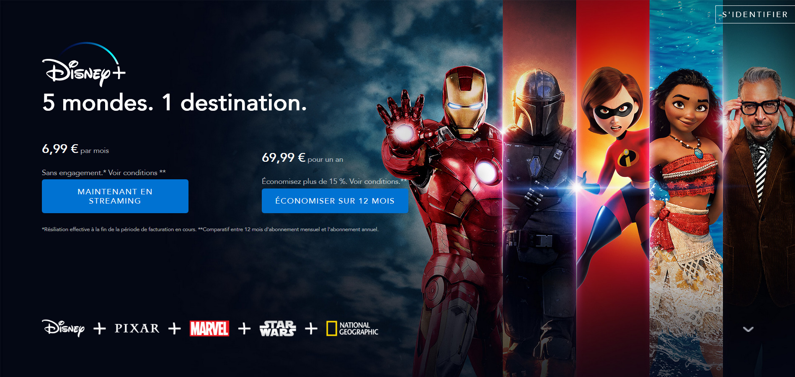
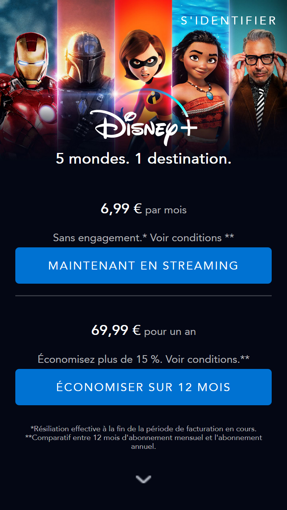

# Disney+
Réaliser une interface utilisateur web statique et adaptable. Le rendu doit s'adapter à toutes les devices et correspondre exactement à la page d'accueil de Disney+ avec un dépôt GitHub contenant les sources de projet. 

HTML5, CSS3, Javascript, Git, GitHub, Flex 

### Voir la démo => [[Click Here]](https://hassanelgallouchi.github.io/disney-plus-project/)

### Accueil Desktop

### Accueil Mobile

